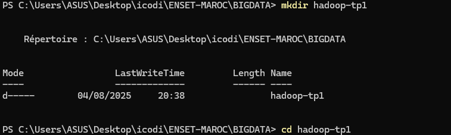
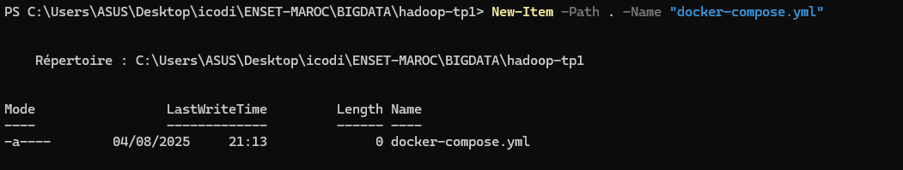
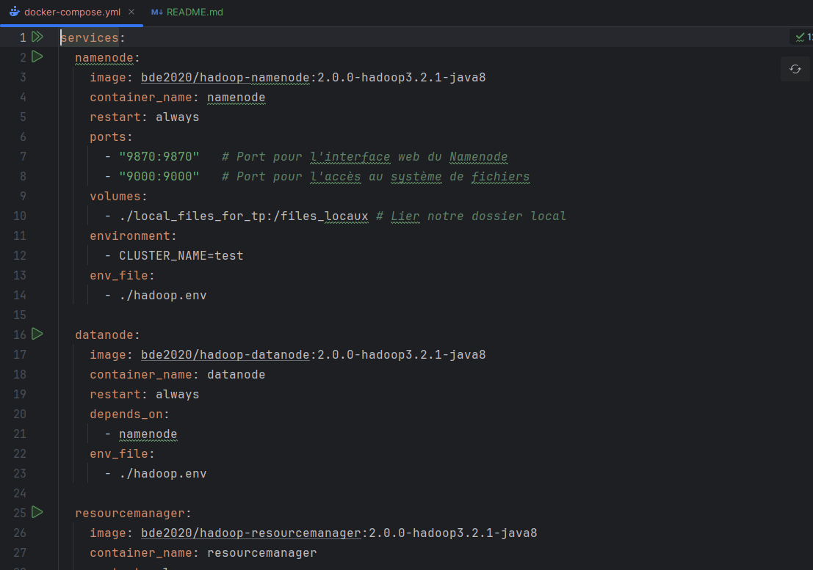
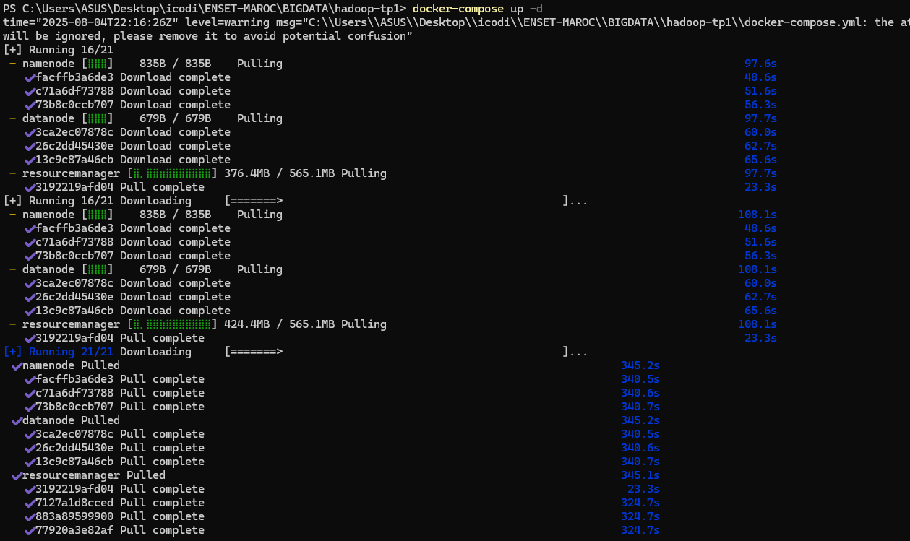
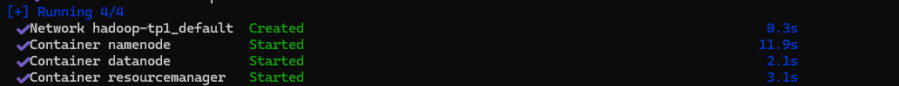
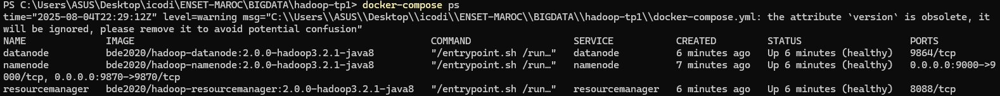
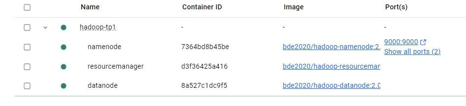

<h1>📦Manipulation du système de fichiers HDFS</h1>

<h3>Nous utiliserons Docker pour simuler un cluster sur notre machine et mettre en place un environnement fonctionnel Hadoop.</h3>

 
<h2>Création du dossier du projet</h2>

<h3>Nous créons dans un terminal le dossier qui servira à contenir nos fichiers de configuration</h3>

 
<h2>Création d'un fichier de configuration - docker-compose.yml</h2>

<h3>Nous créons dans un terminal le dossier qui servira à contenir nos fichiers de configuration</h3>

 

 

 
<h2>Lancement du cluster</h2>

<h3>Dans notre terminal, nous lançons la commande: <strong>docker-compose up -d</strong></h3>

 

<h2>Vérification du bon fonctionnement du cluster via la commande: docker-compose ps</h2>
 

 
