<h1>📦Manipulation du système de fichiers HDFS</h1>

<h3>Nous utiliserons Docker pour simuler un cluster sur notre machine et mettre en place un environnement fonctionnel Hadoop.</h3>

 
<h2>Création du dossier du projet</h2>

<h3>Nous créons dans un terminal le dossier qui servira à contenir nos fichiers de configuration</h3>

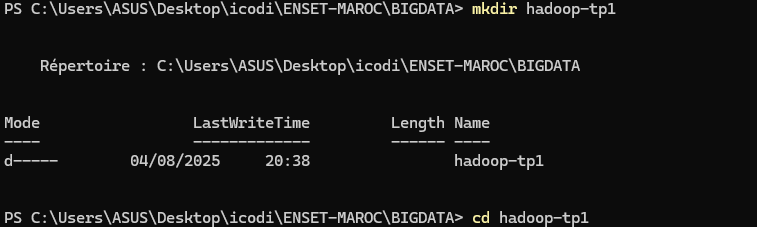
 
<h2>Création d'un fichier de configuration - docker-compose.yml</h2>

<h3>Nous créons dans un terminal le dossier qui servira à contenir nos fichiers de configuration</h3>

 
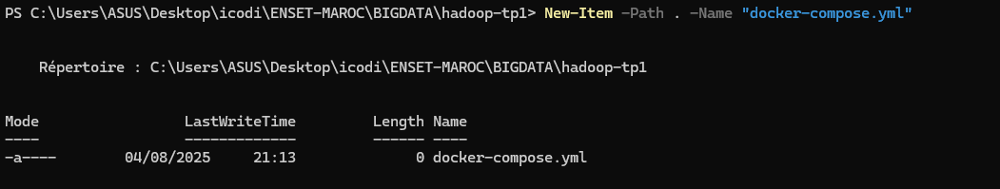
 
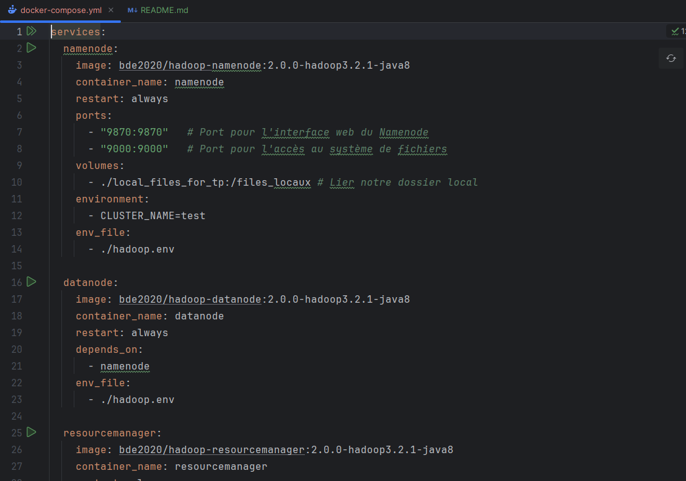
 
<h2>Lancement du cluster</h2>

<h3>Dans notre terminal, nous lançons la commande: <strong>docker-compose up -d</strong></h3>

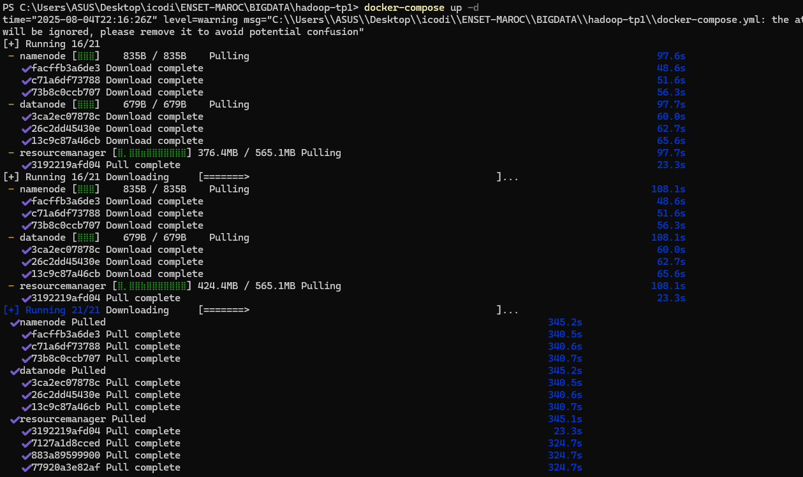
 
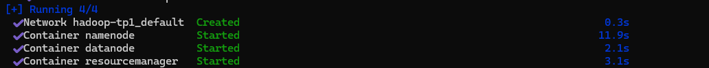
<h2>Vérification du bon fonctionnement du cluster via la commande: docker-compose ps</h2>
 
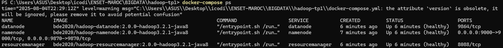
 
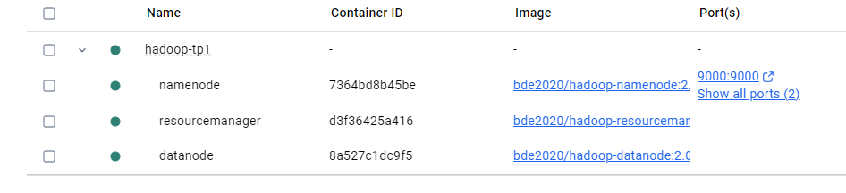
 
<ol>
<li><h2><li>Création dans la racine du HDFS l’arborescence principale</li></h2>
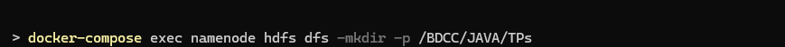
 
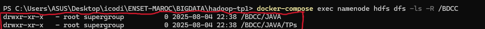
 
<h2><li>Création dans le répertoire Cours de CPP les fichiers CoursCPP1, CoursCPP2 et
CoursCPP3. Puis ajout du contenu dans les fichiers crées.</li></h2>
<ul>
<li>Créons d'abord le sous-dossier CPP à la racine de BDCC</li>
 

 
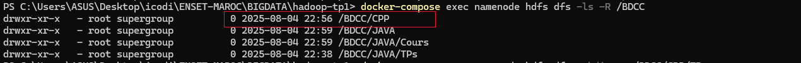
 
<li>Créons ensuite les sous-dossiers "Cours" et "Tps" à la racine de CPP</li>
 
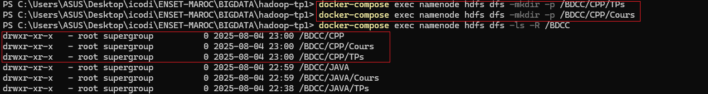
 
<li>Enfin créons les fichiers "CoursCPP1", "CoursCPP2" et "CoursCPP3" dans le répertoire "Cours" de "CPP"</li>
 
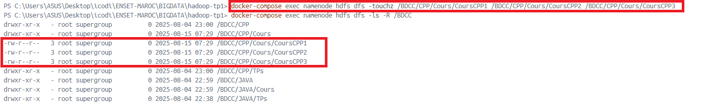
 
<li>Ajoutons du contenu dans les fichiers "CoursCPP1", "CoursCPP2" et "CoursCPP3" créés</li>
 
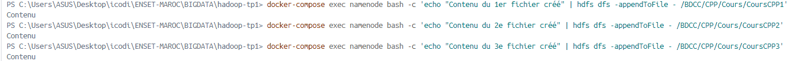
</ul>
 
<h2><li>Affichage du contenu des fichiers CoursCPP1, CoursCPP2 et CoursCPP3.</li></h2>

 
<h2><li>Copie des fichiers CoursCPP1, CoursCPP2, CoursCPP3 dans le répertoire Cours de JAVA</li></h2>
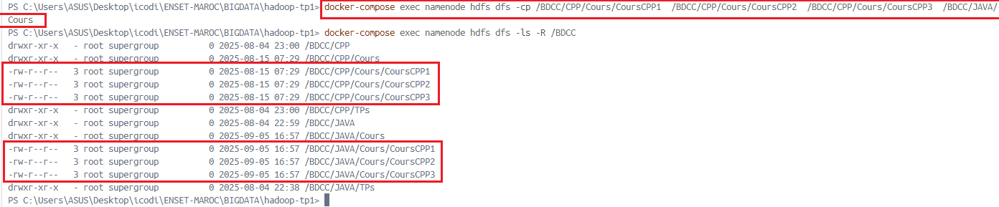
 
<h2><li>Suppression du fichier CoursCPP3 du répertoire Cours de JAVA et Renommage de CoursCPP et CoursCPP2 en CoursJAVA1 et CoursJAVA2</li></h2>
<ul>
<li>Suppression du fichier CoursCPP3 du répertoire Cours de JAVA</li>
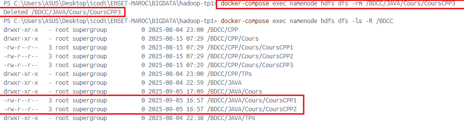
 
<li>Renommage de CoursCPP et CoursCPP2 en CoursJAVA1 et CoursJAVA2</li>
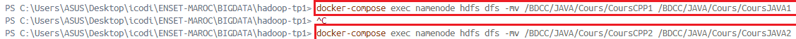
 
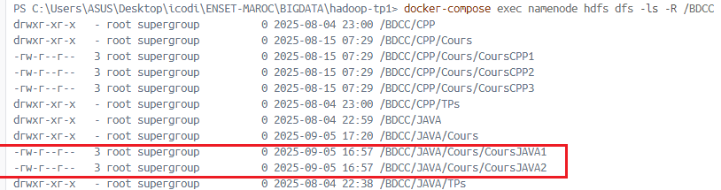
</ul>
 
<h2><li>Création dans le répertoire des fichiers locaux : TP1CPP, TP2CPP, TP1JAVA, TP2JAVA, TP3JAVA</li></h2>
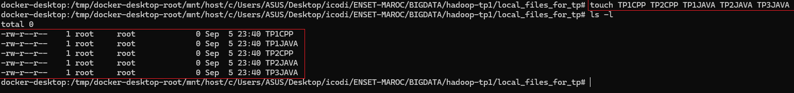
 
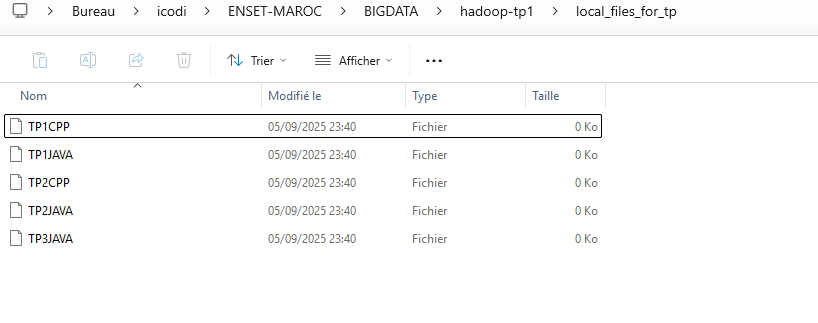
 
<h2><li>Copie des fichiers TP1CPP, TP2CPP du système de fichier local vers le répertoire TPs de JAVA</li></h2>
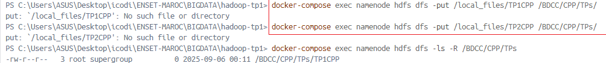
</li>
</ol>